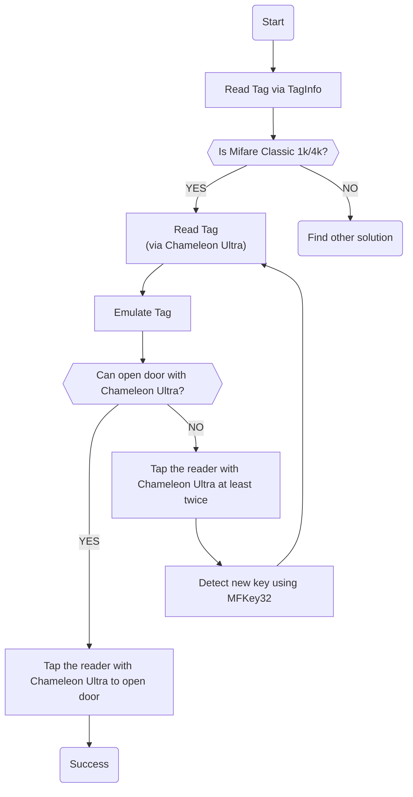

# 使用變色龍快速拷貝旅館房卡

::: warning
本文章的內容僅限學術及研究用途，本文讀者請勿進行任何違法行為，否則後果自負。
:::

大家好，我是「[chameleon-ultra.js](https://taichunmin.idv.tw/chameleon-ultra.js/)」的作者均民。

不知道大家在外住宿時，有沒有遇過房卡不夠用的困擾？前陣子均民跟朋友去日本自由行，入住的旅館只給了 1 張 NFC 房卡，但房間的總電源卻需要插卡才能供電。如果有人想自己出門逛逛，這就尷尬了，因為室友還在房間，就只能把卡片留在房內；要是兩個人想分開行動，還得先喬好房卡該由誰保管，實在非常不方便！

所以現在均民出遊基本上都會帶著 Chameleon Ultra（簡稱：變色龍）跟魔術卡在身上。如果房卡剛好是變色龍能夠破解的 Mifare Classic 卡片，就有機會可以輕鬆拷貝一張房卡，完美解決這個問題！

## 什麼是 MFKey32 攻擊？

MFKey32 是一種針對 Mifare Classic 卡片讀卡機的攻擊手法。這種攻擊手法的原理，是先用我們的設備去模擬成卡片，然後拿去給讀卡機讀取至少兩次。

在認證過程中，模擬的卡片會產生一個隨機數（稱為 Tag Nonce）傳送給讀卡機，並記錄下讀卡機的回應。因為這個隨機數是我們自己產生的，所以就能透過演算法還原出讀卡機所用的金鑰（Key）。

## 什麼硬體支援 MFKey32 攻擊？

市面上支援 MFKey32 攻擊的硬體其實不少，在我寫這篇文章的時候，最常見的大概是這三種：Proxmark3、Chameleon Ultra、Flipper Zero。

由於攻擊過程需要親自與讀卡機互動，我個人最推薦使用變色龍 Chameleon Ultra。因為它的體積超級小、內建電池，還能透過 USB 和藍牙（BLE）連接，讓它成為執行這項任務的最佳選擇。相比之下，Proxmark3 和 Flipper Zero 不僅價格昂貴，體積也大上許多。

## 拷貝步驟

進行 MFKey32 攻擊的核心流程大致如下：

1. 用變色龍讀取房卡的卡號，並模擬成該房卡（需要開啟偵測功能）。
2. 拿著變色龍去感應門鎖的讀卡機至少 2 次（這幾次都會失敗，是正常的！）。
3. 從變色龍中讀取剛剛跟讀卡機互動的認證紀錄。
4. 利用這些紀錄來破解（計算出）金鑰。
5. 用破解出來的金鑰來讀取整張房卡的資料。

請點此打開流程圖

### 確認卡片類型

::: info
NFC TagInfo by NXP (Android)
- <https://play.google.com/store/apps/details?id=com.nxp.taginfolite>
:::

現在市面上支援 NFC 功能的智慧型手機，大多都能讀取通訊頻率為 13.56 MHz 的高頻卡。在 NFC 這塊，Android 系統對開發者比 iOS 系統來得開放，所以均民會推薦大家準備一台有 NFC 功能的 Android 手機。

均民通常會用 Android 手機上的 TagInfo App 來快速確認卡片類型。記得要選擇「Full Scan」，然後把房卡放在手機的 NFC 天線附近（天線位置通常在手機背後的中間）：

如果在「Full Scan」的結果中有看到 `android.nfc.tech.MifareClassic`，就代表這張房卡很可能是 Mifare Classic 1k/4k，我們就可以拿出變色龍進行下一步了。

如果房卡不是這種卡片，那就得另尋他法了，因為文章篇幅因素，這篇文章只會專注在拷貝 Mifare Classic 這種卡片的拷貝上。

### 讀取及模擬房卡

::: info
變色龍的 MFKey32 網頁工具 (請在 Windows、macOS、Android 系統上使用 Chrome 瀏覽器開啟)
- <https://taichunmin.idv.tw/chameleon-ultra.js/mfkey32.html>
:::

請打開我上面提供的網頁工具，把房卡放在變色龍正面，點擊「Read Tag」按鈕，選擇你的變色龍裝置，耐心等待程式讀取房卡，然後確認讀取結果：

讀取成功後，請選擇一個你想要使用的卡槽（我這邊以「Slot 1」為例），然後點擊「Emulate」按鈕，讓變色龍開始模擬這張房卡：

### 測試變色龍是否能夠開門

模擬成功後，請帶著變色龍和原房卡，到門外把門鎖上，測試看看模擬的卡片是否能成功開門。如果能順利開門，恭喜你，房卡已經成功拷貝了！

如果還是沒辦法開門，我們就需要繼續進行下一步。

### 使用變色龍騙取卡片金鑰

如果還是沒辦法開門，就代表這個門鎖除了驗證卡號（UID）之外，還會讀取卡片內其他扇區（Sector）的資料。這時候，請勇敢地再拿著變色龍去感應門鎖 2 次，這個步驟是為了收集破解金鑰所需的資料。

接著，回到網頁工具，點擊「Recover」按鈕，並耐心等待程式計算金鑰。計算完成後，程式會跳出計算結果，並更新目前的卡片金鑰列表。在卡片金鑰的編輯視窗中點擊「Apply」即可儲存並關閉：

接下來，請重複執行「讀取及模擬房卡」的步驟，直到能夠成功開門為止。

## 拷貝房卡

出門旅行不太可能帶好幾個變色龍在身上，所以當模擬成功後，下一步就是把變色龍裡的資料，寫入到空白的「魔術卡」上，這樣就能擁有更多張拷貝的房卡了。

### 魔術卡推薦

一張正常的 NFC 卡片，它的卡號（UID）是唯讀的，被保護起來無法修改。不過，有廠商專門販售可以修改卡號的特殊卡片，這種卡片俗稱為「魔術卡」。

目前市面上最常見的兩種魔術卡是 UID 和 CUID 卡。我個人推薦優先使用 UID 卡來進行拷貝。

因為 UID 卡是透過特殊的後門指令來修改卡號，比較不容易寫壞；而 CUID 卡如果操作不當，一不小心寫錯資料，卡片就會直接報廢（俗稱「變磚」）。所以，除非 UID 卡無法成功拷貝，再考慮使用 CUID 卡。

### 使用變色龍寫入到魔術卡

::: info
變色龍的 Mifare 1K 網頁工具 (請在 Windows、macOS、Android 系統上使用 Chrome 瀏覽器開啟)
- <https://taichunmin.idv.tw/chameleon-ultra.js/mifare1k.html>
:::

請先關閉剛剛的 MFKey32 工具，然後打開我上面提供的 Mifare 1K 網頁工具，點擊「Load」按鈕，從變色龍讀取剛剛模擬成功的卡片資料：

如果你用的是 UID 魔術卡，請把魔術卡放在變色龍正面，點擊「UID」區塊內的「Write」按鈕，耐心等待寫入完成：

如果你用的是 CUID 魔術卡，一樣把魔術卡放在變色龍正面，點擊「CUID」區塊內的「Write」按鈕，耐心等待寫入完成：

### 測試拷貝卡是否能夠開門

成功寫入魔術卡後，最後一步當然就是實測啦！記得帶著原房卡和剛拷貝好的魔術卡，到門外實際測試看看能不能成功開門。如果能順利開門，就大功告成！

如果失敗了也別灰心，以下列出幾個可能的失敗原因及解決辦法，你可以再試一次或是換張魔術卡挑戰看看：

1. **魔術卡已損壞**：換一張新的魔術卡再試一次。
2. **讀卡機有偵測機制**：某些讀卡機會偵測魔術卡，遇到這種情況可以嘗試換另一種類型（例如 UID 換 CUID）的魔術卡。

## 相關連結

如果你在看完文章後，對這個主題有興趣或是有任何問題，都歡迎隨時透過 [Facebook](https://www.facebook.com/taichunmin) 找我聊聊！

- [chameleon-ultra.js](https://taichunmin.idv.tw/chameleon-ultra.js/)
- [Dismantling MIFARE Classic](http://proxmark.org/files/Documents/13.56%20MHz%20-%20MIFARE%20Classic/Dismantling.MIFARE.Classic-ESORICS.2008.pdf)
- [Recovering MIFARE Classic keys](https://docs.flipper.net/zero/nfc/mfkey32)
- [How to use mfkey32 on ChameleonUltra devices](https://shop.mtoolstec.com/how-to-use-mfkey32-on-chameleonultra-devices.html)
